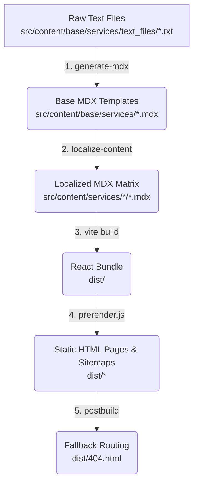

# Tantalus Geomatics - Build Pipeline & Architecture Documentation

This document maps out the entire architecture and build pipeline of the Tantalus Geomatics website. It details how raw text content transitions through Python compilation, JavaScript localization, Vite bundling, and headless Chrome static pre-rendering to produce a highly optimized, SEO-hardened static website.

---

## 1. Pipeline Overview & Script Interactions

The build pipeline is defined in [`package.json`](package.json:6) and consists of five sequential stages. Each stage depends on the outputs of the previous stage:



### Script Definitions in [`package.json`](package.json:6)
- **`generate-mdx`**: Runs [`scripts/convert_to_mdx.py`](scripts/convert_to_mdx.py:1) to compile raw text files into base MDX templates.
- **`localize-content`**: Runs [`scripts/generate-localized-content.js`](scripts/generate-localized-content.js:1) via `tsx` to generate localized service pages for all 14 target locations.
- **`build`**: Chains the entire pipeline: `npm run generate-mdx && npm run localize-content && vite build && node prerender.js`.
- **`postbuild`**: Copies `dist/index.html` to `dist/404.html` to provide a fallback for client-side routing on static hosts.

---

## 2. Stage 1: MDX Generation (`scripts/convert_to_mdx.py`)

The Python script [`scripts/convert_to_mdx.py`](scripts/convert_to_mdx.py:1) acts as the content ingestion engine. It parses custom structured text files and converts them into React-compatible MDX templates.

### Inputs
- **Source Directory**: `src/content/base/services/text_files/`
- **File Format**: `.txt` files containing custom Markdown-like section headers:
  - `# **Title**`
  - `# **Body**`
  - `# **Steps**`
  - `# **Deliverables**`
  - `# **FAQs**`

### Parsing Logic
1. **Section Identification**: Uses a regular expression [`header_pattern`](scripts/convert_to_mdx.py:27) to split the file into isolated sections.
2. **Steps Parsing**: [`parse_steps()`](scripts/convert_to_mdx.py:59) extracts numbered steps and splits them into structured JSON objects containing `title` and `description`.
3. **Deliverables Parsing**: [`parse_deliverables()`](scripts/convert_to_mdx.py:88) extracts bulleted lists, strips leading bullet symbols, and cleans up Markdown formatting.
4. **FAQs Parsing**: [`parse_faqs()`](scripts/convert_to_mdx.py:111) parses numbered Q&A blocks into structured JSON objects containing `question` and `answer`.
5. **SEO Description Generation**: Maps the service name against a dictionary of high-intent suffixes [`SERVICE_DESCRIPTION_SUFFIXES`](scripts/convert_to_mdx.py:226) to generate unique, high-quality meta descriptions.

### Outputs
- **Destination Directory**: `src/content/base/services/`
- **File Format**: `.mdx` files containing:
  - **YAML Frontmatter**: Metadata fields (`title`, `description`, `serviceName`, etc.) with placeholders (e.g., `{{LOCATION_NAME}}`).
  - **React Imports**: Imports [`ServiceTemplate`](src/templates/ServiceTemplate.tsx) as the default layout wrapper.
  - **Metadata Export**: Exports a structured `metadata` object containing parsed steps, deliverables, and FAQs, alongside image and link placeholders.
  - **Body Content**: Appends the raw Markdown body at the end of the file.

---

## 3. Stage 2: Content Localization (`scripts/generate-localized-content.js`)

The localization script [`scripts/generate-localized-content.js`](scripts/generate-localized-content.js:1) expands the base MDX templates into a multi-dimensional matrix of localized pages.

### Inputs
- **Base Templates**: Base MDX files from `src/content/base/services/*.mdx`.
- **Locations List**: Parsed from `VALID_LOCATIONS` in [`src/config/locations.ts`](src/config/locations.ts:1).
- **Resource Mappings**: Imports images, links, and coordinates from [`src/config/resourceMapping.ts`](src/config/resourceMapping.ts:1).

### Processing & Mapping Logic
For each base service template and each location, the script:
1. **Retrieves Location Data**: Looks up the location's name, local authority, and municipal links from `LOCATION_MAPPING`.
2. **Resolves Resources**: Fetches location-specific and service-specific images and links from [`src/config/resourceMapping.ts`](src/config/resourceMapping.ts:1).
3. **Replaces Placeholders**: Replaces template placeholders (e.g., `{{LOCATION_NAME}}`, `{{HERO_IMAGE}}`, `{{SERVICE_LINKS}}`) with resolved JSON strings and text.
4. **Injects Inline Images**: Uses [`injectServiceImage()`](scripts/generate-localized-content.js:138) to insert a styled `` tag with dynamic, localized alt text directly after the first paragraph of the body.
5. **Generates Schema.org JSON-LD**: Constructs a localized `ProfessionalService` schema (including coordinates, address, and nested `Service` details) and injects it into the MDX `metadata` object.
6. **Sanitizes Content**: Strips Markdown asterisks and HTML tags from frontmatter and metadata fields to prevent syntax errors and ensure clean SEO tags.

### Outputs
- **Destination Directory**: `src/content/services/${locationSlug}/${serviceSlug}.mdx` (e.g., `src/content/services/squamish/subdivisions-surveys.mdx`).

---

## 4. Stage 3: Vite Compilation (`vite build`)

Vite compiles the React application and the generated MDX files into a production-ready client-side bundle.

### Configuration ([`vite.config.ts`](vite.config.ts:1))
- **React Support**: Uses `@vitejs/plugin-react` to compile JSX/TSX.
- **Tailwind CSS v4**: Uses `@tailwindcss/vite` for CSS processing.
- **MDX Compilation**: Uses `@mdx-js/rollup` with `remark-frontmatter` to compile MDX files into standard React components.

### Dynamic Routing & Code Splitting ([`src/App.tsx`](src/App.tsx:48))
- Localized routes are defined as `/:locationSlug/services/:serviceSlug`.
- The route is guarded by [`LocationRouteGuard`](src/App.tsx:31), which redirects invalid location slugs to the generic fallback path.
- The route renders [`DynamicLocationService`](src/pages/DynamicLocationService.tsx:10), which uses Vite's `import.meta.glob` to dynamically import the target MDX file:
  ```typescript
  const moduleKey = `../content/services/${locationSlug}/${serviceSlug}.mdx`;
  ```
- Because MDX files export `ServiceTemplate` as their default export, rendering the imported component automatically wraps the MDX content in the layout shell.

---

## 5. Stage 4: Static Prerendering (`prerender.js`)

To achieve maximum performance and SEO indexing, [`prerender.js`](prerender.js:1) crawls the compiled React application and exports it as static HTML files.

### Route Discovery
1. Scans `src/content/services/`, `src/content/blog/`, and `src/content/projects/` to discover all localized and fallback routes.
2. Combines them with static core routes (e.g., `/`, `/about/`, `/faq/`) to generate a master route matrix.

### Crawling Loop
1. **Express Server**: Starts a local Express server on port 3000 serving the `dist/` directory.
2. **Puppeteer Launch**: Launches a headless Chrome browser.
3. **Page Crawling**: For each route:
   - Sets `window.__IS_PRERENDERING = true` to allow client-side scripts to detect pre-rendering.
   - Navigates to `http://localhost:3000${url}` and waits for network idle (`networkidle0`).
   - Waits for the React app to mount (`#root > div`).
   - Runs an in-page script to remove duplicate `<title>`, `<meta name="description">`, and `<link rel="canonical">` tags.
   - Extracts the fully rendered HTML.
   - Writes the HTML to `dist/${url}/index.html` (e.g., `/squamish/services/subdivision-surveys/` becomes `dist/squamish/services/subdivision-surveys/index.html`).
4. **Fault Tolerance**: The crawling loop is wrapped in a try-catch block. If a single page fails or times out, it logs the error, closes the page, and continues to the next route, ensuring the build completes.

### Sitemap Generation
After crawling, the script generates:
- **Child Sitemaps**: Individual XML sitemaps for `pages`, `services`, `blog`, and `projects` (e.g., `dist/sitemap-services.xml`).
- **Master Sitemap Index**: A `dist/sitemap-index.xml` file referencing all child sitemaps.
- **IndexNow Notification**: If `INDEXNOW_KEY` is present, it writes the key file and submits the updated URL list to search engines.

---

## 6. Critical Dependencies & Architectural Risks

### 1. File Path & Naming Conventions
- **Risk**: The localization script and routing rely on strict naming conventions. If a `.txt` file is renamed (e.g., `Subdivisions Surveys.txt` vs `Subdivision Surveys.txt`), it can break resource mappings in [`src/config/resourceMapping.ts`](src/config/resourceMapping.ts:1) or generate mismatched slugs.
- **Mitigation**: The Python script contains a normalization mapping [`SERVICE_DESCRIPTION_SUFFIXES`](scripts/convert_to_mdx.py:226) and slugification logic to standardize names.

### 2. Token & Build Performance
- **Risk**: Generating 30 services across 14 locations results in **420 MDX files**. Compiling and pre-rendering 420+ pages in Puppeteer takes significant time and memory.
- **Mitigation**: Puppeteer pages are opened and closed sequentially, and the crawling loop is fully fault-tolerant to prevent build crashes.

### 3. Hydration Mismatch (React Error #418)
- **Risk**: If the HTML generated by Puppeteer differs from what React expects on the client side, hydration will fail. This often happens when block-level elements (like lists or divs) are nested inside `<p>` tags.
- **Mitigation**: Layout components like [`ServiceTemplate`](src/templates/ServiceTemplate.tsx) and [`GeoDirectAnswer`](src/components/GeoDirectAnswer.tsx) have been hardened to use `<div>` wrappers instead of `<p>` wrappers for dynamic content.
